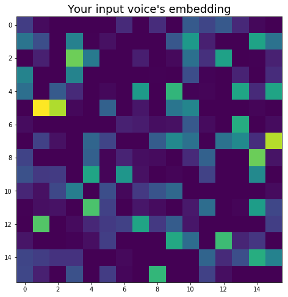
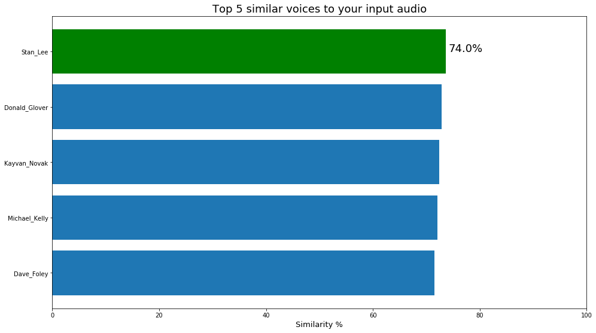

# Voice comparison

To-the-point and easy-to-use program that compares your voice with a database of 1251 celebrities.

## Python Package Requirements

- Pandas
- Numpy
- Sklearn
- Resemblyzer

## Description

The program takes an input audio file and uses Resemblyzer library to embed your voice into a 1D vector of 256 values.
Then, using cosine similarity it compares your voice with 1251 celebrities and tells you who has the most similar voice.

Please, take into account this is just a fun project. Be aware of its limitations.

I tried it with an audio of my own and below you can see the results.

   
   

# Dataset

The dataset used is VoxCeleb1 and can be found [here](http://www.robots.ox.ac.uk/~vgg/data/voxceleb/vox1.html).

The whole dataset's size is +30GB and contais lots of audios fom each celebrity. 
To make it simple, I only kept 1 audio per celebrity. 
I also processed and embeded all of them and saved it all in a single file (*embeded_voices.npy*) of 1.3MB that I could upload here.

## Usage

#### Step 1

Clone the repository and add a .wav file. Change its name to "your_audio.wav" if you don't want to change the code.

#### Step 2

Run the program and get your results!

